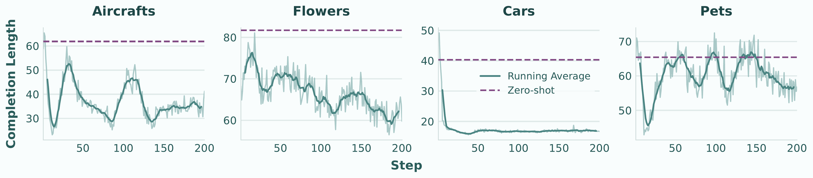
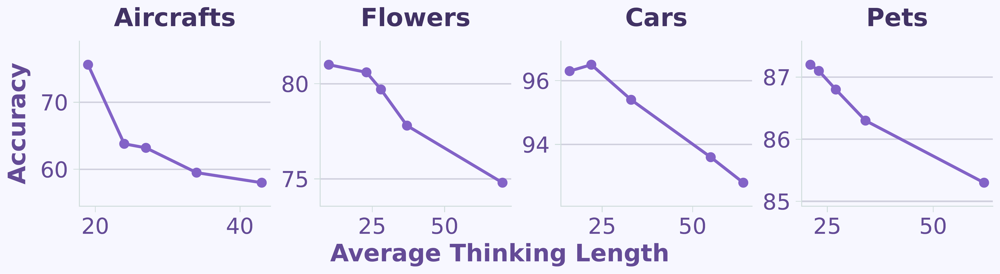

<div align="center">

# Can Textual Reasoning Improve the Performance of MLLMs on Fine-grained Visual Classification?

[](https://arxiv.org/abs/2601.06993)
[](https://refine-rft.github.io/)
[](LICENSE)

**CVPR 2026 Findings**

<p align="center">
  <a href="https://github.com/jiezhu23"><strong>Jie Zhu</strong></a><sup>1</sup>
  ·
  <a href="https://cse.msu.edu/~suyiyan1/"><strong>Yiyang Su</strong></a><sup>1</sup>
  ·
  <a href="https://www.cse.msu.edu/~liuxm/"><strong>Xiaoming Liu</strong></a><sup>1,2</sup>
</p>

<sup>1</sup>Michigan State University&nbsp;&nbsp;&nbsp;<sup>2</sup>University of North Carolina at Chapel Hill

</div>

ReFine-RFT studies the role of textual reasoning in fine-grained visual classification (FGVC). We find that longer chain-of-thought often hurts visual classification accuracy, a phenomenon we call the **Cost of Thinking**. ReFine-RFT combines **ensemble rewards** with **Multi-Reward Normalization (MRN)** to provide accuracy-oriented feedback while controlling reasoning length.


## News
- [2026-05-10] Code and data released.
- [2026-04-10] arXiv v2 released.
- [2026-01-11] Paper released on arXiv.

## Highlights

- **Cost of Thinking:** CoT reasoning length is a key factor in FGVC performance degradation; concise reasoning is often better than verbose reasoning.
- **Multi-Reward Normalization:** MRN normalizes heterogeneous reward signals independently before aggregation, improving multi-objective RFT stability.
- **ReFine-RFT:** A reinforcement fine-tuning framework with ensemble rewards for format, classification accuracy, thinking length, MLLM-based accuracy, and embedding similarity.

## Environment Setup

```bash
git clone https://github.com/jiezhu23/ReFine-RFT.git
cd ReFine-RFT

conda create -n refinerft python=3.10
conda activate refinerft

bash setup.sh
```

## Datasets

### Training set

We follow the 4-shot FGVC classification datasets used by Visual-RFT. The answer-only datasets are hosted by Visual-RFT on Hugging Face:

| Dataset | Task | Setting | Description |
| --- | --- | --- | --- |
| `laolao77/ViRFT_CLS_fgvc_aircraft_4_shot` | Classification | 4-shot | FGVC-Aircraft, 100 categories |
| `laolao77/ViRFT_CLS_flower_4_shot` | Classification | 4-shot | Oxford Flowers-102, 102 categories |
| `laolao77/ViRFT_CLS_car196_4shot` | Classification | 4-shot | Stanford Cars, 196 categories |
| `laolao77/ViRFT_CLS_pets37_4shot` | Classification | 4-shot | Oxford-IIIT Pets, 37 categories |

For CoT SFT, we generated reference responses with `gpt-4o` from these 4-shot classification datasets. The generated datasets add a `reference` field containing the concise CoT response used for SFT. These datasets are not yet public on Hugging Face, but we provide a script to create the HF dataset locally from released JSONL files:

#### Building CoT Datasets from Released JSONL

We also release the GPT-4o batch response files under `src/refinerft/data/`:

```text
src/refinerft/data/*_cot_dataset_query_result_*.jsonl
```

These JSONL files can be merged with the original Visual-RFT 4-shot datasets to recreate the CoT SFT datasets locally, without making new OpenAI API calls:

```bash
python src/refinerft/data/create_cotdataset_hf.py \
  --dataset_name laolao77/ViRFT_CLS_car196_4shot \
  --output_dir ./src/refinerft/data/ \
  --dataset_cache_dir ./share_data \
  --merge_only
```

This writes a Hugging Face `DatasetDict` to:

```text
share_data/ViRFT_CLS_car196_4shot_cot
```

Change `--dataset_name` to build the other CoT datasets. The merge code matches responses by the `custom_id` index in the JSONL files and stores the generated CoT response in the `reference` field.

#### Publishing the CoT SFT Datasets

If you have the local merged CoT datasets under `share_data/`, you can publish each dataset with:

```bash
huggingface-cli login

python - <<'PY'
from datasets import load_from_disk

local_path = "share_data/ViRFT_CLS_car196_4shot_cot_20words"
repo_id = "<your-hf-namespace>/ViRFT_CLS_car196_4shot_cot"

dataset = load_from_disk(local_path)
dataset.push_to_hub(repo_id, private=False)
PY
```

Repeat this for Aircraft, Flowers, Cars, and Pets. Before publishing, inspect a few samples and make sure the dataset card mentions that the `reference` responses were generated with `gpt-4o`.

### Testing set

Download the testing set image and change to correspond `DATASET_IMG_PATH` in `classification/Qwen2_VL_classification_infere.py`

## Training

The main scripts are in `src/scripts/`. Update `ACCELERATE_PATH`, `PYTHON_PATH`, `GPU_IDS`, and the YAML config paths for your environment before running.

The scripts assume a multi-GPU machine. If `flash-attn` installation fails because your CUDA/PyTorch versions differ from the wheel in `setup.sh`, install the wheel matching your environment or remove `--attn_implementation flash_attention_2` from your local config.

### Cost of Thinking

<p align="center">
  
</p>
<p align="center">
  
</p>

We provide config templates in `src/refinerft/configs`, such as:

```bash
src/refinerft/configs/train_configs_grpo_lora_r64a128_think{N}_aircrafts.yaml
```

where `N` is the `min_len` value of the `think_length` reward, which controls the length of CoT reasoning.

Reference script:
```bash
bash src/scripts/2B_fewshotcls_think_length.sh
```

### ReFine-RFT / MRN Training

We have `accuracy_mllm`, which needs to deploy reward model before the training:

```bash
bash src/scripts/refinerft_run_lmdeploy.sh
```

Then start the training script:
```bash
bash src/scripts/2B_fewshotcls_mrpo.sh
```

Example config:

```bash
src/refinerft/configs/train_configs_mrpo_lora_r64a128_aircrafts.yaml
```

The MRN/ReFine-RFT configs use `train_method: "mrpo"` and a reward ensemble such as:

```yaml
reward_funcs:
  - format
  - accuracy
  - think_punishment
  - accuracy_mllm
  - embedding_similarity
```

- `format`: checks the expected `<think>...</think><answer>...</answer>` response format.
- `accuracy`: checks whether the extracted answer matches the ground-truth fine-grained category.
- `think_punishment` or `think_length`: controls overly long reasoning.
- `accuracy_mllm`: uses an MLLM judge to score semantic alignment with the ground truth.
- `embedding_similarity`: uses embedding similarity between prediction and ground truth.

### GRPO Baseline

```bash
bash src/scripts/2B_fewshotcls_grpo.sh
```

### SFT Baselines

Answer-only SFT:

```bash
bash src/scripts/2B_fewshotcls_sft.sh
```

CoT SFT:

```bash
bash src/scripts/2B_fewshotcls_sft_cot.sh
```

For CoT SFT, set `use_cot: true` in the YAML config and point `dataset_name` to the released CoT SFT dataset once it is public.

## Evaluation

Classification evaluation scripts are in `classification/`. The evaluation pipeline is also integrated into training.

```bash
cd classification
python Qwen2_VL_classification_infere.py \
  --model_path /path/to/your/checkpoint \
  --model_base Qwen/Qwen2-VL-2B-Instruct \
  --cache_dir ./share_models \
  --dataset_name fgvc_aircraft \
  --prompt_type cot
```

Supported `dataset_name` values:

- `fgvc_aircraft`
- `oxford_flowers`
- `stanford_cars`
- `pets`


## GPT-4o CoT Data Generation

For convenience, we provide the pipeline for generating CoT responses. To generate new CoT responses yourself, run the GPT-4o batch generation script:

```bash
bash src/scripts/refinerft_cotdataset_gen.sh
```

The underlying Python entry point is:

```bash
python src/refinerft/data/create_cotdataset_hf.py \
  --dataset_name laolao77/ViRFT_CLS_flower_4_shot \
  --output_dir ./src/refinerft/data/ \
  --max_sample 150 \
  --num_slice 5
```

The OpenAI client reads credentials from your environment. Set `OPENAI_API_KEY` locally; do not commit it.

## Citation
If you find the code and idea is helpful, please consider citing of paper:
```bibtex
@inproceedings{zhu2026refinerft,
  title={Can Textual Reasoning Improve the Performance of MLLMs on Fine-grained Visual Classification?},
  author={Zhu, Jie and Su, Yiyang and Liu, Xiaoming},
  booktitle={CVPR Findings},
  year={2026}
}
```

## Acknowledgements

This codebase builds on the [Visual-RFT](https://github.com/Liuziyu77/Visual-RFT) training setup and the Qwen2-VL ecosystem. We thank the authors for their open-source contributions.
